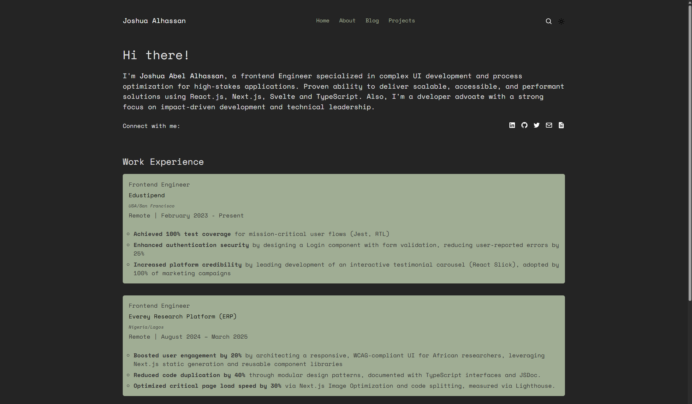
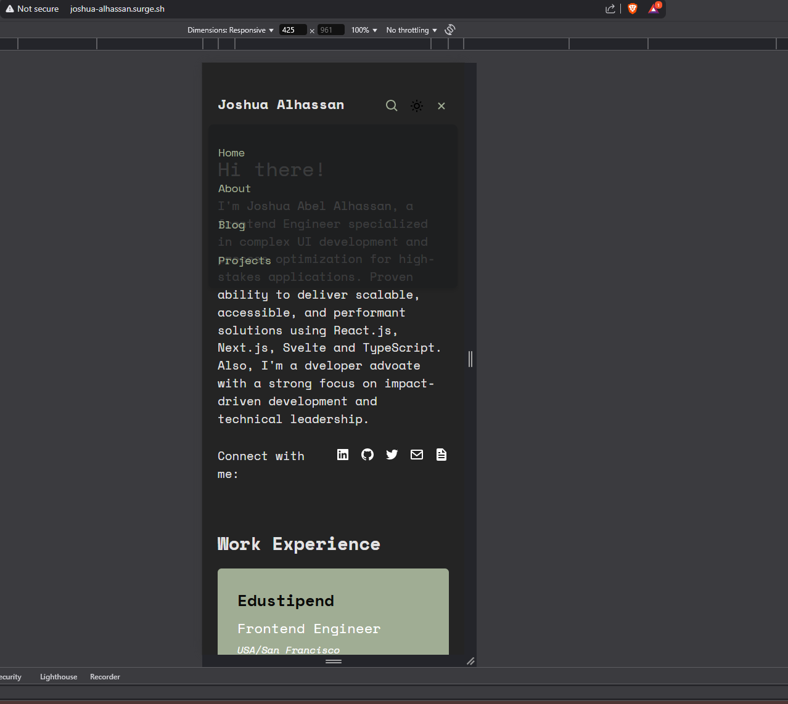

# **Joshua Alhassan - Portfolio Website**

[](https://your-portfolio.vercel.app)
[](https://kit.svelte.dev)
[](https://jsdoc.app)

**A modern, responsive portfolio built with SvelteKit, designed for performance and accessibility.**




## **Features**

✅ **Responsive Design** – Mobile-first approach with seamless desktop adaptation  
✅ **Dark/Light Mode** – Toggleable theme with system preference detection  
✅ **Optimized Performance** – Lazy loading, efficient state management  
✅ **Accessibility Focused** – Semantic HTML, ARIA labels, keyboard navigation  
✅ **Interactive Elements** – Smooth transitions and dynamic UI components

## **🛠 Tech Stack**

- **Frontend**: [SvelteKit](https://kit.svelte.dev/)
- **Styling**: CSS with custom properties (variables)
- **Icons**: [Boxicons](https://boxicons.com/)
- **Deployment**: [Vercel](https://vercel.com/)
- **JSDoc**: [JSDoc](https://jsdoc.app/)

## Component Documentation

All components are documented using JSDoc standards:

**javascript**

```js
/**
 * @file Router Component
 * @description Handles client-side routing and view rendering
 * @prop {RouterInterface} router - Injection of router methods
 */
```

**View complete documentation:**

`bash`
`npm run docs`

## **Getting Started**

### **Prerequisites**

- Node.js ≥ 16
- npm or yarn

### **Installation**

1. Clone the repo:
   ```sh
   git clone https://github.com/Josh-Alhassan/portfolio-website.git
   ```
2. Install dependencies:
   ```sh
   npm install
   ```
3. Run the development server:
   ```sh
   npm run dev
   ```
4. Open [http://localhost:5173](http://localhost:5173)

### **Build for Production**

```sh
npm run build
```

## **Project Structure**

```
src/
├── routes/            # Page-based routing
│   ├── about/         # About page
│   └── blog/          # Blog section
├── components/        # Reusable components
│   ├── Navigation.svelte
│   ├── Footer.svelte
|   ├── Profile.svelte
|   ├── Project.svelte
|   ├── Router.svelte
|   ├── WorkExperienc.svelte
│   └── ...
├── lib/            # Page-based routing
│   ├── router.js      # Router component
├── app.css            # Global styles
├── app.svelte         # Root page
└── ...
```

## **🚀 Deployment**

1. **Vercel** (Recommended):

   - Push to GitHub/GitLab and import into Vercel
   - Configure build command: `npm run build`
   - Output directory: `.svelte-kit/vercel`

2. **Netlify**:

   ```sh
   npm install -g netlify-cli
   netlify deploy
   ```

3. **Surge**:
   ```sh
   npm install --global surge
   # In the project director, just run ....
   surge
   ```

## **License**

MIT © [Joshua Alhassan](https://github.com/Josh-Alhassan)

---

🔗 **Live Demo Vercel**: [portfolio-website-lemon-gamma-45.vercel.app/](https://portfolio-website-lemon-gamma-45.vercel.app/)
🔗 **Live Demo Using Surge**: [alhassanjoshua.surge.sh/](http://alhassanjoshua.surge.sh/)

---
